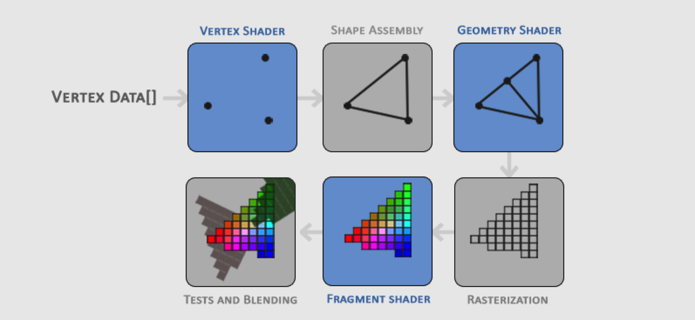

## 描述
  * what: openGL是规范和库，只定义了规范结果，并没有实现 实现一般由显卡制造商实现
  * 使用：openGL库、GLFW等(第三方提供的实现 针对openGL更好提供屏幕呈现 提供OpenGL上下文，定义窗口参数和处理用户输入)、GLAD(库 运行时查询第三方提供的函数 并检索、存储指针、引用；也可自己做这件事 但繁琐)。三方配合使用

## 备注
 * 调用openGL库接口前 确保载入GLAD头文件，它包含正确的openGL头文件。 使用openGL库接口通过GLAD调用，运行是正确找到方法的指针。
 
## 图形管道
 * 图形管道可分为2大部分：1.将3D坐标转换至2D坐标。 2.将2D坐标转换为实际的彩色像素
 * 图形管道将一组3D坐标作为输入，并将这些坐标转换为屏幕上的彩色2D像素。
 * 图形管道所有阶段的抽象表示。请注意，蓝色部分表示我们可以注入自己的着色器的部分。
   * 
   * 顶点数据->顶点着色器(顶点处理 物体空间坐标系转换成世界空间坐标 标准化设备坐标NDC)->shapeAssembly(形状部件 组合顶点形成图元)->几何着色器(通过生成新顶点 形成新的图元 细化)->光栅化(图元映射到最终屏幕上的相应像素 产生片段)->剪裁(丢弃视图外面的片段)->片元着色器(计算得到最终像素颜色)
   * NDC:x,y,z值变化在[-1, 1] 超出此范围的任何坐标都会被丢弃，然后NDC坐标通过视口变换得到屏幕空间坐标。然后，生成的屏幕空间坐标将转换为片段，作为片段着色器的输入。
## 着色器
 * GPU上运行的小程序，处理图形管道中的数据。
 * 基本类型: int、float、double、uint、bool、vertors(向量)、matrices(矩阵)  
 
## 纹理
 * 坐标系的区别 顶点坐标标准化后在[-1, 1]之间((0,0)点在屏幕中间) 纹理坐标标准化后在[0, 1]之间
